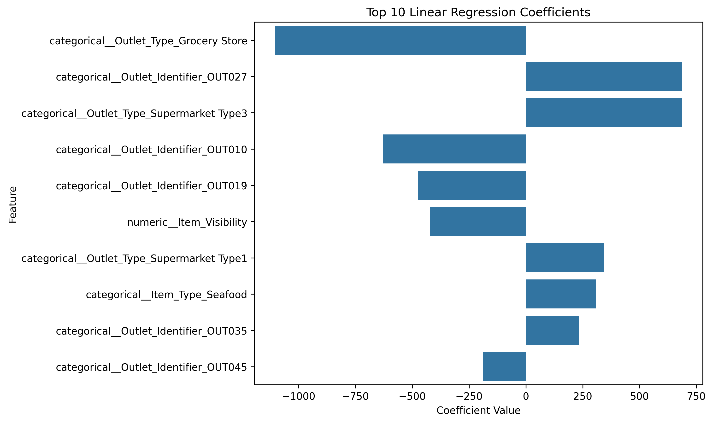
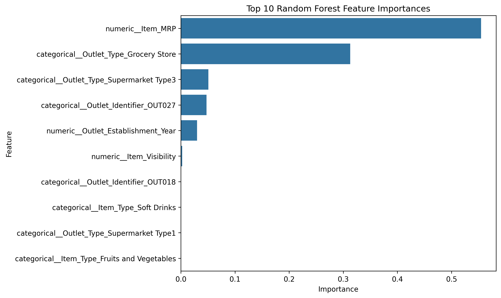

# Prediction-of-Product-Sales

## Project Description

This project analyzes a sales prediction dataset to better understand how product and outlet characteristics relate to item outlet sales. The dataset includes product features such as item weight, item visibility, item type, item MRP, and item fat content, as well as outlet features such as outlet size, outlet location type, outlet type, and outlet establishment year.

The main goal of this project is to explore the data, identify important patterns, and create visualizations that can help explain which factors may play a role in increasing sales. These insights can also support future machine learning models for predicting item outlet sales.

## Exploratory Data Analysis
### Key Visual 1: Item Outlet Sales by Outlet Type

Supermarket Type3 shows the highest median sales compared to other outlet types, suggesting that outlet type is an important factor in sales performance.

### Key Visual 2: Correlation Heatmap of Numerical Features

The heatmap shows that Item_MRP has the strongest positive correlation with Item_Outlet_Sales. Combined with the previous boxplot, this suggests that both product pricing and outlet type may be important factors in sales performance.

---

## Model Interpretation

To better understand how the models made their predictions, I analyzed both the Linear Regression coefficients and the Random Forest feature importances. This helps explain which product and outlet features had the strongest impact on predicted sales.

---

### Linear Regression Coefficients

The Linear Regression coefficients show which features increased or decreased the predicted sales values.

The top impactful features in this model were mainly related to outlet type and outlet identity. `Outlet_Type_Grocery Store` had a strong negative coefficient, meaning the model predicted lower sales for products sold in grocery stores. On the other hand, `Outlet_Type_Supermarket Type3` and `Outlet_Identifier_OUT027` had strong positive coefficients, meaning the model associated these outlets with higher predicted sales.

This means that the type of store plays an important role in sales performance. The same product may have different sales results depending on the outlet where it is sold. Overall, the Linear Regression model suggests that outlet characteristics are key factors in understanding and predicting product sales.

---

### Random Forest Feature Importances

The Random Forest model shows that the top important features were mainly `Item_MRP`, `Outlet_Type_Grocery Store`, `Outlet_Type_Supermarket Type3`, `Outlet_Identifier_OUT027`, and `Outlet_Establishment_Year`.

`Item_MRP` was the most important feature by far. This means product price or product value played the biggest role in the model’s predictions. Outlet-related features were also very important, which shows that store type and store identity have a strong relationship with sales performance.

Overall, the model suggests that sales are mainly influenced by a combination of product value and outlet characteristics. For a retailer, this means that both pricing decisions and store format can have a major impact on expected sales.

---

## Final Model Summary

Several machine learning models were tested to predict product sales, including Linear Regression, Random Forest, and a tuned Random Forest model.

The tuned Random Forest model performed the best overall. It had the strongest test performance and showed a better balance between training and testing results compared to the default Random Forest model.

The final model explained about **60% of the variation in sales**. This means the model is not perfect, but it was able to capture useful patterns in the data and provide meaningful business insights.

---

## Final Recommendation

Based on the model results, the tuned Random Forest model is the recommended model for this project.

For a business stakeholder, this model can help estimate product sales using information about the product and the outlet. These predictions can support decisions related to inventory planning, product placement, pricing, and outlet performance.

The most important insights from this project are that **product price** and **outlet type** are strong factors related to sales. Retailers can use these insights to better understand which products and outlets are likely to perform well.

